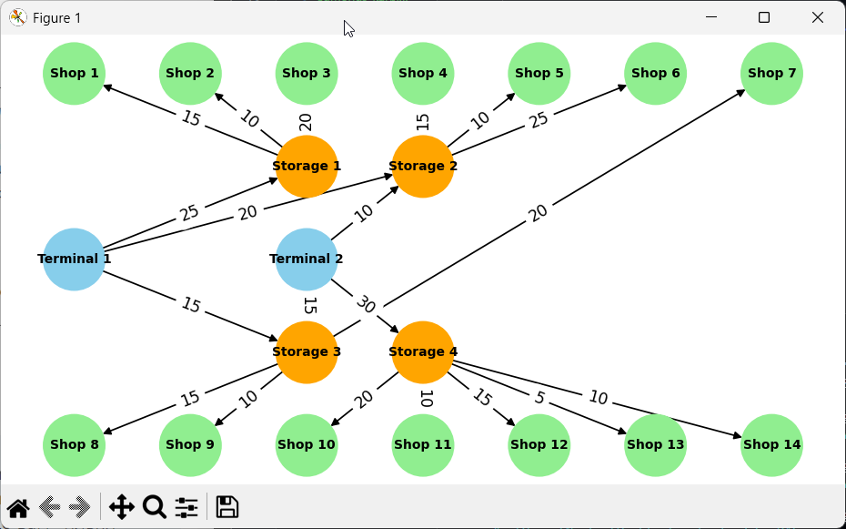

## Task 1
Побудований граф із пропускними здатностями:

Під час виконання завдання було додано SuperSource та SuperSink - місця, де весь товар умовно створюєтся та зникає, відповідно. Ця умовність необхідна для розрахунку максимального потоку від джерела до стоку. 

Максимальний потік, згідно з алгоритмом, становить 115 одиниць. Розраховується за максимальною пропускною здатністю терміналів. Сумарна здатність складів та магазинів перевищує це число, тому вони не є вузьким місцем.

Оптимального потоку досягнуто, адже не існує доповнюючих шляхів та усі вихідні ребра із терміналів насичені.

Для даної мережі це означає, що вузьким місцем є термінали. Для збільшення загального потоку потрібно збільшувати пропускну здатність терміналів.

Відповіді на питання:
1. Які термінали забезпечують найбільший потік товарів до магазинів? Згідно з таблицею фактичних потоків - Terminal 1. А саме 59. Згідно з пропускною здатністю - Terminal 1, а саме 60.

2. Які маршрути мають найменшу пропускну здатність і як це впливає на загальний потік? Найменшу пропускну здатність має маршрут Storage 4 Shop 13, який може пропустити максимум 5 одиниць товару. А також Storage 1 Shop 3 - 10 одиниць. Ці обмеження створюють вузькі місця, які, за наявності великого попиту на товари, бдуть спричиняти затримки. 

3. Які магазини отримали найменше товарів і чи можна збільшити їх постачання, збільшивши пропускну здатність певних маршрутів?
Найменше товарів отримали: Shop 3, Shop 9, Shop 12, Shop 13, Shop 14. Для збільшення постачання можна збільшити пропускну здатність ребер Terminal -> Storage.

4. Чи є вузькі місця, які можна усунути для покращення ефективності логістичної мережі? Так, є. А саме шлях Storage 4 Shop 13, який має пропускну здатність 5. Теоретично можна, але я ю просто збільшила пропусну здатність цього місця.